# Monster Behaviour Reference

Designer/developer reference for how every monster decides, moves, and fights. Stats and AI profiles live in `src/content/monsters.json`; the combat phase runs through `src/game/monsterAi.ts` and the ATBMB engine under `src/game/atbmb/`.

**How to use this doc**

1. Read **Shared systems** once — most monsters reuse these rules.
2. Jump to a monster section for its state machine, damage, and spawn notes.
3. Check **Related entities** for bone piles and tangleweed vines (not full monsters, but they interact with them).

---

## Table of contents

- [Shared systems](#shared-systems)
  - [Turn phase order](#turn-phase-order)
  - [Scaling](#scaling)
  - [Movement & occupancy](#movement--occupancy)
  - [Status ticks](#status-ticks)
  - [Kill rewards](#kill-rewards)
  - [Spawn & placement](#spawn--placement)
  - [ATBMB engine](#atbmb-engine)
  - [Tile preferences](#tile-preferences)
  - [Distance metrics](#distance-metrics)
- [Related entities](#related-entities)
  - [Bone piles](#bone-piles)
  - [Tangleweed vines](#tangleweed-vines)
- [Monsters](#monsters)
  - [Slime](#slime)
  - [Dust Rat](#dust-rat)
  - [Shadow Rodent](#shadow-rodent)
  - [Skeleton](#skeleton)
  - [Skeleton Archer](#skeleton-archer)
  - [Elite Skeleton](#elite-skeleton)
  - [Mimic](#mimic)
  - [Douvlon](#douvlon)
  - [Mystic Core](#mystic-core)
  - [Rockling](#rockling)
  - [Corrupted Shade](#corrupted-shade)
  - [Vineshon](#vineshon)
  - [Tangleweed Bloom](#tangleweed-bloom)
  - [Drosir](#drosir)
  - [Beetle](#beetle)
  - [Boneling](#boneling)

---

## Shared systems

### Turn phase order

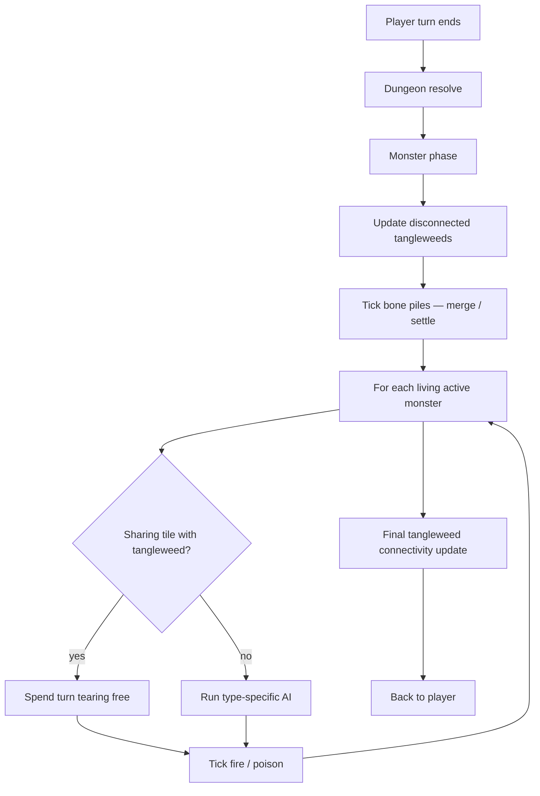

Notes:

- Elite Skeleton’s low-HP teleport runs **after every player action**, not inside the monster phase.
- Douvlon pairs act **once per pair** (whichever member is reached first).
- If a monster is trapped by tangleweed, it skips its normal AI that turn.

### Scaling

Monsters spawn at `level = danger` (floor threat), except Elite Skeleton which uses `danger + 1`.

| Formula | Value |
|--------|--------|
| **Max HP** | `baseHp + 2 × max(0, level − 1)` |
| **Damage bonus** | `max(0, level − 1)` added to each outgoing damage roll |
| **Defense** | Incoming damage: `max(0, raw − defense)` |
| **Defense sources** | Def from JSON, or `defenseOverride` (Rockling), plus **+5** while Black Shield is active (Shade) |

### Movement & occupancy

**Passable tiles**

| Monster type | Can enter |
|--------------|-----------|
| Land (default) | Floor; water **only if** a bridge is present |
| Aquatic (`drosir`) | Water only |

**Blocked by:** other living monsters, the player, rocks, living tangleweed vines.

**Not blocked by:** bone piles (walkable), withered vines (treated as gone for connectivity / spawn blocking rules as implemented).

**Harming cloud:** stepping onto an active harming cloud deals **5** damage to the monster.

**Pots:** monsters break pots when they step on them.

### Status ticks

After each monster’s turn (including tangleweed-escape turns):

| Status | Effect |
|--------|--------|
| **Fire** | Damage = `max(1, ⌊maxHp × 0.2⌋)`; then `fireLevels − 1`. Synced across a Douvlon pair. Can kill. |
| **Poison** | Nominal **3** if the monster moved this turn, else **1**; capped so HP cannot go below 1 (`min(nominal, hp − 1)`); then `poisonLevels − 1`. Pair-synced. |

### Kill rewards

When a monster dies:

1. **Mimic (player kill only):** full chest loot table applied in the reducer.
2. **8%** chance to drop **1 gold** on the death tile.
3. Player gains **EXP = monster `power`**.
4. **Boneling →** convert to a [bone pile](#bone-piles).

Monster-phase kills (e.g. slime leaping onto another monster) still grant EXP / coin / Boneling conversion, but **skip** Mimic chest loot.

### Spawn & placement

#### Room density

| Room kind | Monsters |
|-----------|----------|
| Entrance | None |
| Corridor | 38% chance of **1** |
| Normal | 68% → **1**, else **2** |
| Treasure | 65% → **1**, else **2**; always at least one chest; +12% extra chest if ≥2 monsters |
| Greenhouse | **1–2** (bloom / vineshon only; no pots) |
| Gauntlet | Empty until entered |
| Gauntlet corridor | Empty |

#### Pool selection (`pickMonsterId`)

Weight within a pool: `1 / power` (higher power → rarer).

| Condition | Effect |
|-----------|--------|
| Depth ≥ 4, normal/treasure | **3.5%** force **Mimic** |
| Depth ≥ 5 | Dust Rat pool slot becomes **Shadow Rodent**; pools may include **Elite Skeleton** |
| Depth ≥ 2 | Pools may include **Skeleton Archer** |
| Overgrown theme | Rat slot → **Vineshon**; normal rooms **8%** force **Tangleweed Bloom** |
| Brownstone theme | Pools add **Beetle** |
| Greenhouse | 35% Bloom / 65% Vineshon |
| Depth ≥ 4, whole floor | **4%** spawn one **Douvlon pair** on adjacent free floors |
| Damp theme | Per water room: **45%** spawn one **Drosir** on free water |

#### Gauntlet wave

On first entry: seal corridor, spawn wave with budget `totalPower = depth × 5 + 5`, partitioned from powers `{2, 4, 5}` (and `{8}` if depth ≥ 5):

| Power | Monster |
|------|---------|
| 8 | Elite Skeleton |
| 5 | Rockling |
| 4 | Skeleton / Mystic Core (/ Shadow Rodent) |
| 2 | Slime / Rat (or Vineshon) |

Prefer spawn cells not orthogonally adjacent to the player.

#### Dungeon cards

| Card | Spawn |
|------|--------|
| Monsters from the Deep | `2 + depth` attempts into random rooms |
| You Are Not Alone | Spawns **Corrupted Shade** |
| Overgrowth | Extra tangleweed blooms in greenhouses |

---

### ATBMB engine

Most data-driven monsters use **ATBMB** (Ability / Tile-preference / Behaviour / Monster Brain). Profile in JSON → `runAtbmbTurn`.

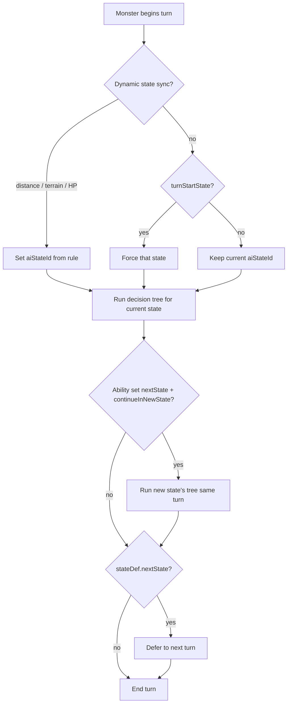

#### Decision tree

For the current state, rules are tried **in order**:

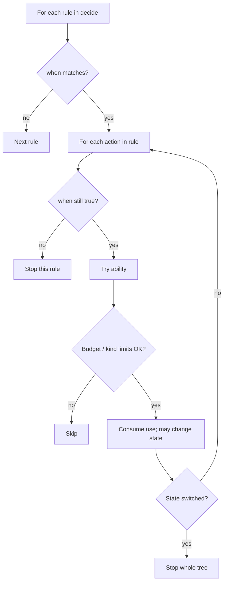

**Budgets**

- Each ability defaults to **1 use** per turn unless `uses` is set (e.g. Skeleton `step` has `uses: 2`).
- `maxActionsPerTurn` caps successful ability uses (Rockling / Mystic Core: **1**).
- `oneAbilityKindPerTurn` (Archer): once you move **or** load **or** fire, you cannot use a different kind that turn.

**Seek modes** (for move abilities): `favored`, `secondary`, `away_from_bad`, `away_from_player`, `toward_player`, etc. Pathfinding uses shortest paths to scored goals, avoiding disliked tiles when possible.

For **`seek: "favored"`** when secondary prefs exist: if no favored tile is reachable within the **remaining steps of this move** (actual path length, not Manhattan), goals switch to **secondary**. Among equal-length secondary goals, tiles matching `adjacent_to_ally` + `preferLeader` win the tiebreak.

Multi-step moves (`params.steps > 1`) re-plan each step with remaining step budget (`steps − i`), so “reachable this turn” stays accurate across the whole ability.

#### Legacy fallbacks

If ATBMB data is missing or `runAtbmbTurn` returns null, many types fall back to imperative helpers in `monsterAi.ts` (`takeSkeletonTurn`, `takeDustRatTurn`, …).

---

### Tile preferences

Each AI state can declare:

| Tier | Score | Role |
|------|-------|------|
| **Favored** | +1000 | Primary goals (where it wants to stand / attack from) |
| **Secondary** | +100 | Backup goals (e.g. Boneling ally clump) |
| **Tertiary** | +10 | Weak preference |
| **Bad / disliked** | −500 | Avoid; usually **cannot enter** unless already standing on disliked |

Scoring also biases toward proximity to favored goals / the player.

Common preference kinds:

| Kind | Meaning |
|------|---------|
| `adjacent_to_player` | Distance 1 (manhattan or chebyshev) |
| `plus_from_player` | Orthogonal cross from player within min–max |
| `diagonal_adjacent_to_player` | Chebyshev corner (1,1) |
| `distance_to_player` | Distance in range `[min, max]` |
| `queen_line_from_player` | Rook/bishop line; often `requireClear` |
| `los_in_radius_from_player` | Any-angle LOS within radius |
| `vine_whip_range_to_player` | Manhattan ≤ N with clear queen path |
| `slime_leap_path` | Tile on a coiled slime’s leap line |
| `pending_collapse` / `pending_targeted_collapse` | Imminent cave-in |
| `flooding_room` | Room currently flooding |
| `adjacent_to_fire` | Ortho/diag neighbor is on fire |
| `adjacent_to_ally` | Next to living ally (optional `preferLeader`) |
| `water` / `not_water` | Terrain checks |
| `los_in_radius…` + `minManhattan` | e.g. archer wants LOS but not hugging |

---

### Distance metrics

```text
Manhattan (|dx| + |dy|)          Chebyshev (max(|dx|, |dy|))

  · · 2 · ·                         · 2 2 2 ·
  · 2 1 2 ·                         2 1 1 1 2
  2 1 @ 1 2                         2 1 @ 1 2
  · 2 1 2 ·                         2 1 1 1 2
  · · 2 · ·                         · 2 2 2 ·
```

- **Orthogonal (ortho) moves:** N/E/S/W only.
- **Any-8 moves:** includes diagonals (Mystic Core).
- **Queen line:** same row, column, or diagonal — used by magic missile / vine whip / Douvlon line.

---

## Related entities

### Bone piles

Created when a **Boneling** dies. Not a monster: walkable prop, no name/HP chrome in the UI (like tangleweed vines).

| Property | Value |
|----------|--------|
| HP | **2** |
| Settle time | **2** monster phases before merge-eligible |
| Walkable | Yes |
| Merge range | Chebyshev ≤ 1 (ortho, diagonal, or same tile) |

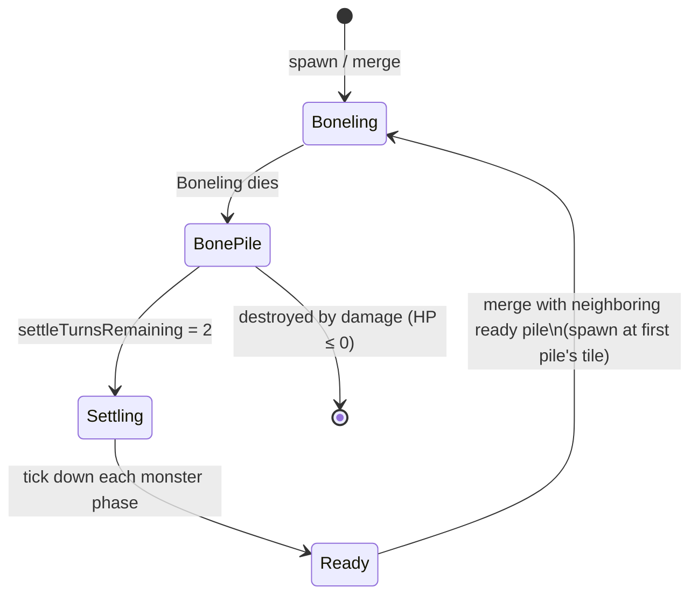

**Death → pile timing:** the killing blow that slays a Boneling does **not** also damage the new pile. Attacks only hit bone piles that already existed on the tile before that strike. A later attack can destroy the pile.

**Merge rules** (`tickBonePiles`, start of monster phase):

1. Ready piles (`settleTurnsRemaining ≤ 0`, HP > 0) may merge first.
2. Find a partner in the 3×3 neighborhood (including same tile).
3. Partner slides onto the first pile’s tile (presentation anim), then both are consumed; spawn one Boneling there at level = current `danger`.
4. Leader flag: only if that room has **no other living Boneling** (and thus no existing leader) — see [Boneling](#boneling).
5. Then remaining settling piles decrement by 1.

Destroying a pile with attacks/AOE/environment does **not** resurrect anything by itself.

### Tangleweed vines

Props spawned by **Tangleweed Bloom** monsters.

| Property | Value |
|----------|--------|
| HP | **1** |
| Spawn | Orthogonal free floor from bloom, else from that bloom’s vine network |
| Can spawn on | Empty floor, **player**, or **monster** |
| Connectivity | Must stay orthogonally connected to a living bloom; else becomes `withered` |

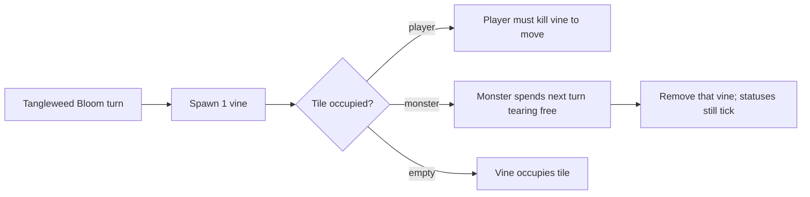

Vines block monster movement occupancy while alive. Sharing a tile with a living vine forces the monster to skip AI and tear free.

---

## Monsters

Base stats below are from JSON **before** level scaling. Damage listed is the roll before the level damage bonus unless noted.

---

### Slime

| | |
|--|--|
| **ID** | `slime` |
| **Stats** | HP 5 · Def 0 · Power **2** |
| **AI** | ATBMB |
| **Move** | Ortho · 1 step (`ooze`) |

**Behaviour:** approach the orthogonal “plus” around the player at distance 1–2, coil (`prepare_leap`), then next turn leap 2 steps along that cardinal for **2–4** damage + **1** knockback.

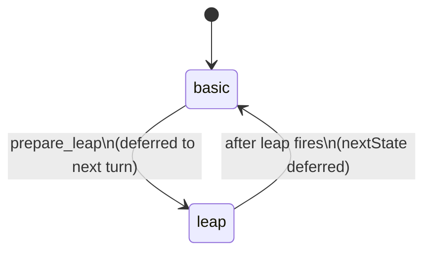

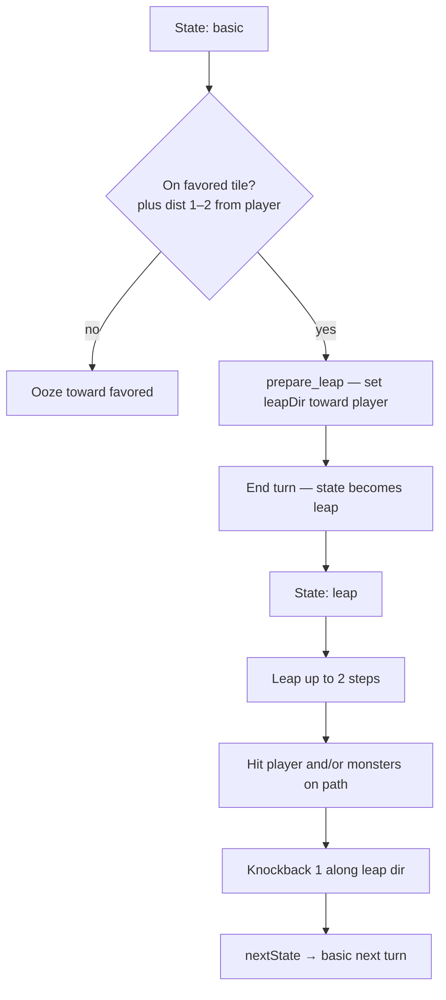

**Favored tiles (plus):**

```text
Player @, favored ·

      ·
    · · ·
  · · @ · ·
    · · ·
      ·
```

(Orthogonal arms at Manhattan 1–2.)

**Leap details**

- Direction locked at prepare time (cardinal toward player).
- Damages **player and other monsters** on the path; then slime slides as far as passable.
- Knockback along leap direction if destination free.
- Other monsters treat `slime_leap_path` as **bad** (Skeleton / Elite avoid telegraph).

**Spawn:** common in corridor / normal / treasure / gauntlet pools.

---

### Dust Rat

| | |
|--|--|
| **ID** | `dune_rat` |
| **Stats** | HP 4 · Def 0 · Power **2** |
| **AI** | ATBMB (`scurry` + `bite`); legacy fallback if ATBMB unavailable |
| **Depth** | Depth **&lt; 5** (replaced by Shadow Rodent at ≥ 5) |

**ATBMB (live when data present):**

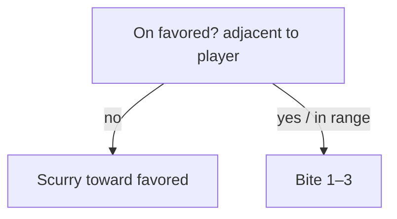

**Legacy fallback nuance:** if already adjacent at turn start, **50%** chance to move-first vs attack-first (can bite then step away, or step then bite).

**Spawn:** corridor / normal / treasure / gauntlet pools (as the “rat” slot). Overgrown floors use Vineshon instead.

---

### Shadow Rodent

| | |
|--|--|
| **ID** | `shadow_rodent` |
| **Stats** | HP 7 · Def 0 · Power **4** |
| **AI** | ATBMB |
| **Depth** | Depth ≥ 5 replaces Dust Rat |

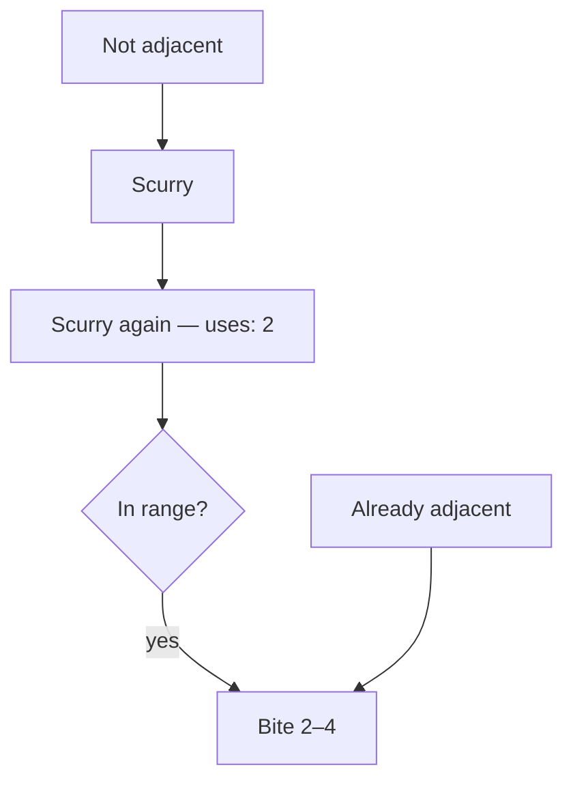

Faster and harder-hitting than Dust Rat: two moves toward adjacency, then bite.

---

### Skeleton

| | |
|--|--|
| **ID** | `skeleton` |
| **Stats** | HP 6 · Def 0 · Power **4** |
| **AI** | ATBMB · `turnStartState: attack` every turn |
| **Move** | Ortho · up to **2** steps |

**Weapon at spawn** (`rollSkeletonWeapon`):

| Weapon | Chance | Damage | Reach |
|--------|--------|--------|-------|
| Sword | 50% | 2–4 | Ortho adjacent |
| Spear | 20% | 2–3 | Ortho Manhattan 1 **or** 2 |
| Axe | 20% | 3–6 | Ortho adjacent; **cannot hit if moved this turn** |
| Scimitar | 10% | 2–5 | Diagonal only (1,1) |

```text
Sword / Axe          Spear               Scimitar
  · · · · ·            · · S · ·            · S · S ·
  · · H · ·            · · H · ·            S · · · S
  · H @ H ·            · H @ H ·            · · @ · ·
  · · H · ·            · · H · ·            S · · · S
  · · · · ·            · · S · ·            · S · S ·
H = hit · S = spear tip / scimitar · @ = player
```

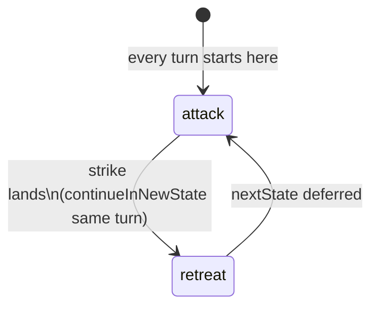

**Attack state**

1. Bad tiles: slime leap path, pending collapses, flooding.
2. Weapon-specific favored tiles (sword/axe adjacent; spear plus dist 2 with secondary adjacent; scimitar diagonal).
3. If not favored → step toward favored (up to 2).
4. If favored and can weapon-melee → **strike** → enter **retreat** immediately.

**Retreat state**

- Bad includes adjacent-to-player (manhattan); scimitar also marks adjacent bad via weapon prefs.
- Step away from player up to 2 times if on bad.
- Next turn forced back to attack.

---

### Skeleton Archer

| | |
|--|--|
| **ID** | `skeleton_archer` |
| **Stats** | HP 6 · Def 0 · Power **5** |
| **AI** | ATBMB · `oneAbilityKindPerTurn: true` |
| **Depth** | Depth ≥ 2 in pools |

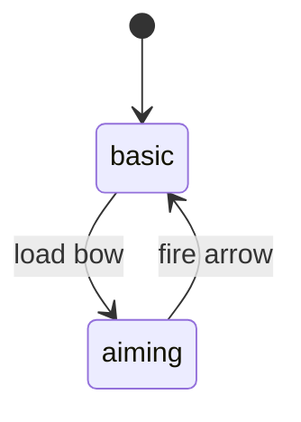

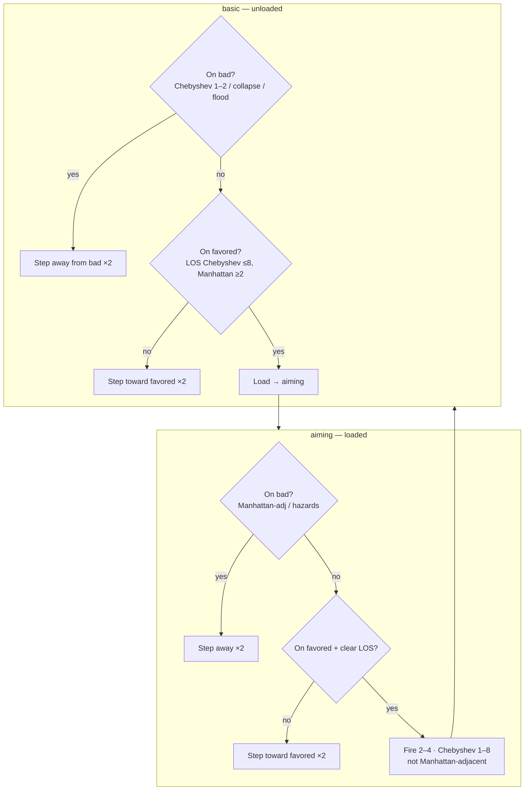

**Important:** because of `oneAbilityKindPerTurn`, an archer that spends the turn stepping **cannot** also load/fire that turn.

**Spawn:** corridor / normal / treasure / gauntlet when depth ≥ 2.

---

### Elite Skeleton

| | |
|--|--|
| **ID** | `elite_skeleton` |
| **Stats** | HP 8 · Def 0 · Power **8** |
| **Level** | `danger + 1` |
| **AI** | ATBMB + custom attack sim |
| **Move** | Ortho · up to **3** steps in attack / retreat |

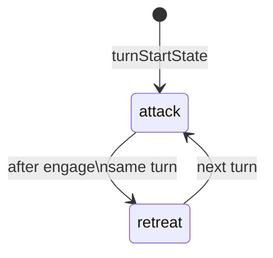

**Attack simulation (`elite_skeleton_attack`):**

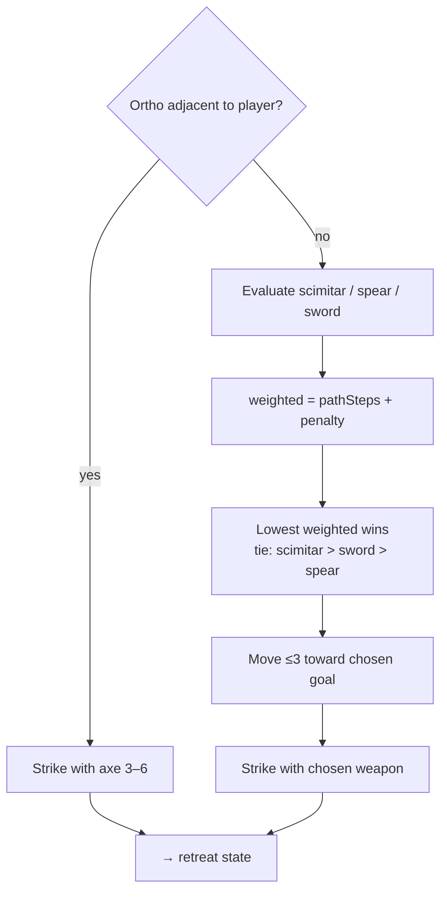

| Option | Favored stand | Base path penalty |
|--------|---------------|-------------------|
| Scimitar | Diagonal adjacent | 0 |
| Sword | Ortho adjacent | +1 |
| Spear | Plus dist 2 | +2 (0 if already teleported once) |

**Retreat:** bad includes Manhattan distance 0–3 to player (plus usual hazards); step away from bad up to 3 times.

**Low-HP teleport** (after player actions, once per elite):

- Trigger: HP ≤ **6** and `eliteTeleported` is false.
- Destination: random floor ≥ Manhattan **4** from player (gauntlet-spawned elites stay in gauntlet).
- Sets `eliteTeleported = true`.

**Spawn:** depth ≥ 5 pools; gauntlet power-8 slot.

---

### Mimic

| | |
|--|--|
| **ID** | `mimic` |
| **Stats** | HP 4 · Def 0 · Power **3** |
| **AI** | ATBMB |
| **Spawn** | Depth ≥ 4, 3.5% in normal/treasure |

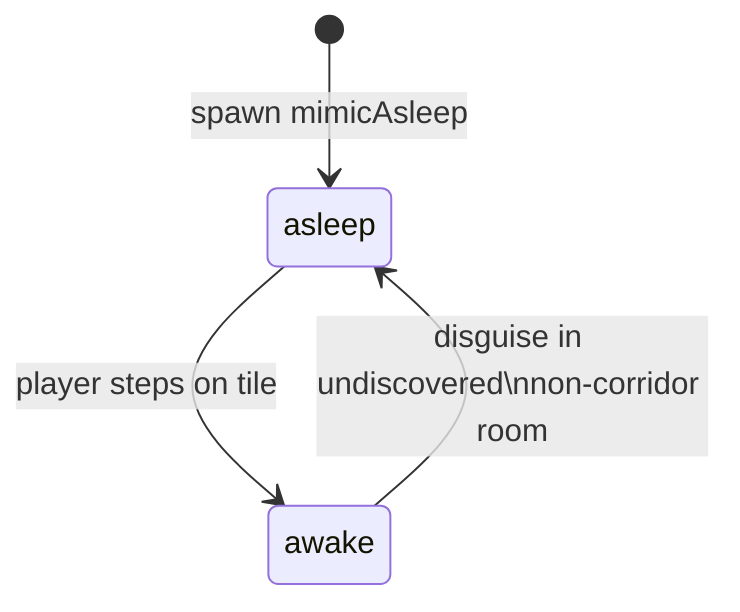

| State | Behaviour |
|-------|-----------|
| **asleep** | Empty decide — looks like a chest; takes no actions |
| **awake** | If in undiscovered non-corridor room → **disguise** back to asleep; else skitter ×2 toward player and bite **3–4** |

**Death (player kill):** chest loot table + standard coin/EXP.

---

### Douvlon

| | |
|--|--|
| **ID** | `douvlon` |
| **Stats** | HP 7 · Def 0 · Power **7** |
| **AI** | Custom (no ATBMB) — pair acts as one |
| **Spawn** | Depth ≥ 4, 4% one red+blue pair |

Shared HP: damaging either updates both. Either at 0 HP culls **both**; one reward.

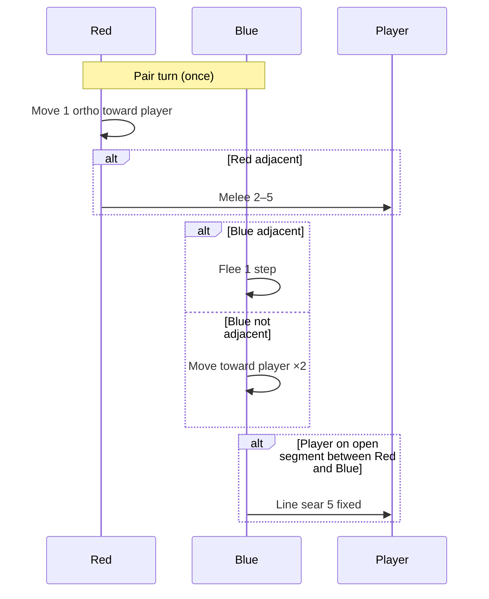

**Line sear geometry:** player strictly between the pair on the same row, column, or 45° diagonal (not on either Douvlons’ tiles).

```text
R · P · B     ← sear
R
·
P             ← sear (vertical)
·
B
```

---

### Mystic Core

| | |
|--|--|
| **ID** | `mystic_core` |
| **Stats** | HP 5 · Def 0 · Power **4** |
| **AI** | ATBMB · `moveStyle: any8` · `maxActionsPerTurn: 1` |

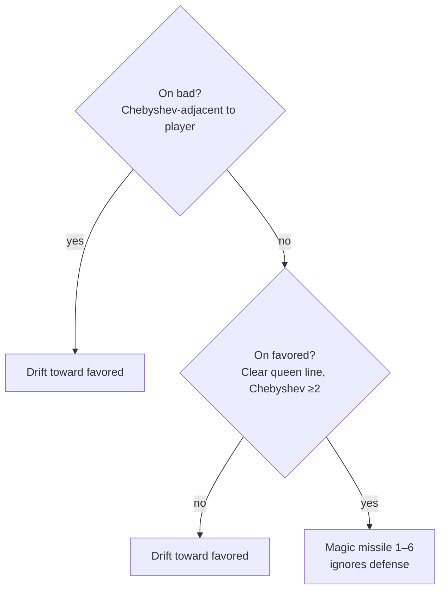

- Only **one** action per turn: either drift or shoot.
- Missile requires clear queen-line path; **ignores player defense** (Resistance can still absorb).

---

### Rockling

| | |
|--|--|
| **ID** | `rockling` |
| **Stats** | HP 5 · Def **1–2** (rolled at spawn as `defenseOverride`) · Power **5** |
| **AI** | ATBMB · `maxActionsPerTurn: 1` |

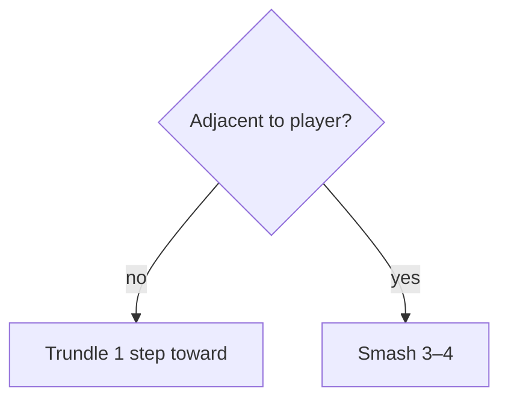

Slow bruiser: move **or** smash, never both. Extra defense makes it tankier than raw HP suggests.

---

### Corrupted Shade

| | |
|--|--|
| **ID** | `corrupted_shade` |
| **Stats** | HP 8 · Def 0 · Power **10** |
| **AI** | Custom deck AI (no ATBMB) |
| **Spawn** | Dungeon card **You Are Not Alone** |

**Deck template (8 cards):**

```text
Move ×3 · Blade ×2 · Dark Bolt ×1 · Shadow Step ×1 · Black Shield ×1
```

Draw **3** per turn (reshuffle discard when empty).

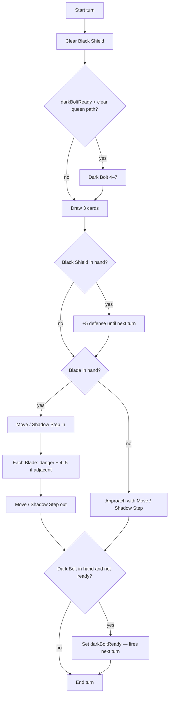

| Card | Effect |
|------|--------|
| **Move** | Up to **2** ortho steps toward or away |
| **Shadow Step** | Teleport to another floor tile in the **same room**, closer or farther |
| **Blade** | If adjacent: damage = `danger + roll(4,5)` |
| **Black Shield** | +5 defense until Shade’s next turn starts |
| **Dark Bolt** | Charge this turn; fire 4–7 next turn if clear queen path |

---

### Vineshon

| | |
|--|--|
| **ID** | `vineshon` |
| **Stats** | HP 4 · Def 0 · Power **2** |
| **AI** | ATBMB · `stateByPlayerDistance` |

Dynamic state: Manhattan ≤ **2** → `close`; else `distant`.

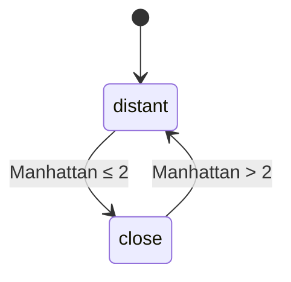

| State | Favored | Action |
|-------|---------|--------|
| **distant** | Clear vine-whip range (Manhattan ≤ 4) | Creep in, then **vine whip** pulls player adjacent along the line |
| **close** | Adjacent | Creep / **lash** 1–3 |

**Bad tiles:** adjacent (8-dir) to anything on fire — keeps away from burning tiles.

**Spawn:** Overgrown rat-slot; greenhouses (65%); Overgrowth card support.

---

### Tangleweed Bloom

| | |
|--|--|
| **ID** | `tangleweed_bloom` |
| **Stats** | HP 5 · Def 0 · Damage 0 · Power **1** |
| **AI** | Custom — no ATBMB |

Each turn: spawn **one** [tangleweed vine](#tangleweed-vines) (HP 1).

1. Prefer orthogonal free tiles around the bloom.
2. If none, expand from living non-withered vines owned by this bloom.
3. May land on the player or a monster (trapping them).

Does not attack directly. Kill the bloom to stop the network; disconnected vines wither.

**Spawn:** Overgrown normal 8%; greenhouse 35%; Overgrowth card.

---

### Drosir

| | |
|--|--|
| **ID** | `drosir` |
| **Stats** | HP 5 · Def 0 · Power **2** · `aquatic: true` |
| **AI** | ATBMB · `stateByTerrain` |

```mermaid
stateDiagram-v2
  [*] --> in_water
  in_water --> out_of_water: standing on dry land
  out_of_water --> in_water: standing on water
```

| State | Behaviour |
|-------|-----------|
| **in_water** | Swim up to **3** water-only steps toward adjacent; bite **2–3** if adjacent while on water. Bad: `not_water`. |
| **out_of_water** | Swim toward water tiles (cannot meaningfully fight on dry land). |

**Spawn:** Damp theme water rooms ~45%.

---

### Beetle

| | |
|--|--|
| **ID** | `beetle` |
| **Stats** | HP 4 · Def **1** · Power **3** |
| **AI** | ATBMB · `stateByHpFraction` |
| **Theme** | Brownstone pools |

```mermaid
stateDiagram-v2
  [*] --> attacking
  attacking --> fleeing: HP ≤ 50% max
  fleeing --> attacking: HP > 50% max
```

| State | Behaviour |
|-------|-----------|
| **attacking** | Scuttle ×2 toward adjacent; bite **2–4** |
| **fleeing** | Favored: Manhattan ≥ 11; bad: Manhattan ≤ 9. If still adjacent → desperate bite; else flee toward far tiles |

```mermaid
flowchart TD
  HP{HP ≤ 50% max?} -->|no| Atk[Approach / bite]
  HP -->|yes| Adj{Currently adjacent?}
  Adj -->|yes| Bite[Desperate bite 2–4]
  Adj -->|no| Flee[Scuttle toward dist ≥ 11]
```

---

### Boneling

| | |
|--|--|
| **ID** | `boneling` |
| **Stats** | HP 3 · Def 0 · Power **1** |
| **AI** | ATBMB · `oneAbilityKindPerTurn` · `maxActionsPerTurn: 1` |
| **Death** | Becomes a [bone pile](#bone-piles) |
| **Sprites** | Variant 0–5 in `aiFlags.spriteVariant` |

#### Abilities

| Ability | Kind | Uses | Effect |
|---------|------|------|--------|
| **Rattle** | move | 1 | Up to **2** ortho steps (`steps: 2`) |
| **Nibble** | melee | 1 | **2–3** damage (manhattan ≤ 1) |

Exactly **one** ability per turn (cannot Rattle then Nibble).

#### Pack roles

```mermaid
flowchart TD
  L{aiFlags.leader?} -->|yes| AdjL{Adjacent to player?}
  AdjL -->|yes| NibbleL[Nibble 2–3]
  AdjL -->|no| Hunt[Rattle toward_player\nup to 2 steps]
  L -->|no| AdjF{Adjacent to player?}
  AdjF -->|yes| NibbleF[Nibble 2–3]
  AdjF -->|no| Fav{Can reach favored\nthis turn? path ≤ 2}
  Fav -->|yes| ToFav[Rattle toward favored\nplayer-adjacent tiles]
  Fav -->|no| ToSec[Rattle toward nearest secondary\nally-adjacent; leader-adj wins ties]
```

| Role | Rule |
|------|------|
| **Leader** | Seeks the player (`toward_player`). Nibble if already adjacent. |
| **Follower** | Nibble if adjacent; else Rattle with `seek: favored`. If no player-adjacent tile is reachable within this turn’s remaining steps, path to **secondary** (ally-adjacent). Equal path lengths prefer tiles next to a **leader**. |

**Tile prefs**

| Tier | Prefs |
|------|--------|
| Favored | `adjacent_to_player` (manhattan) |
| Secondary | `adjacent_to_ally` (same defId) |
| Bad | pending collapse / targeted collapse |

#### Leader spawn

`bonelingLeaderForRoom` sets `aiFlags.leader = true` only when the room has **no other living Boneling** (which also means no existing leader). When several spawn in one pass (floor gen / test packs), they are pushed sequentially so **only the first** in that room becomes leader. Merge-risen Bonelings use the same rule.

Editor brain inspect shows **Leader** in the subtitle and a Pack role line.

**Spawn sources:** bone-pile merge; DEV summon; `testBonelingSpawns` packs (3–5) in rooms when that flag is on. Not in normal floor pools.

---

## Quick reference — combat numbers

| Monster | Attack | Notes |
|---------|--------|-------|
| Slime | Leap 2–4 + KB 1 | Hits path; telegraphed |
| Dust Rat | Bite 1–3 | 1 move |
| Shadow Rodent | Bite 2–4 | 2 moves |
| Skeleton | Weapon table | Attack → retreat |
| Skeleton Archer | Arrow 2–4 | Load then fire; kind lock |
| Elite Skeleton | Weapon sim | Level+1; teleport ≤6 HP once |
| Mimic | Bite 3–4 | Chest loot on player kill |
| Douvlon Red | Melee 2–5 | Pair shared HP |
| Douvlon line | 5 fixed | Between pair |
| Mystic Core | Missile 1–6 | Ignores defense |
| Rockling | Smash 3–4 | Def 1–2; 1 action |
| Corrupted Shade | Blade `danger+4–5` / Bolt 4–7 | Deck AI |
| Vineshon | Whip pull + lash 1–3 | Distance states |
| Tangleweed Bloom | — | Spawns vines |
| Drosir | Bite 2–3 | Water only |
| Beetle | Bite 2–4 | Flees ≤50% HP |
| Boneling | Nibble 2–3 | Rattle ≤2 steps; one ability/turn; pack AI |

All rolls add `monsterDamageBonus(level)` unless marked fixed (Douvlon line sear, Shade blade uses `danger` instead of level bonus).

---

## Source map

| Area | Path |
|------|------|
| Definitions | `src/content/monsters.json` |
| Phase loop | `src/game/monsterAi.ts` |
| ATBMB engine | `src/game/atbmb/*` |
| Spawn factory | `src/game/monsterSpawn.ts` |
| Floor placement | `src/game/initialState.ts` |
| Bone piles | `src/game/boneling.ts` |
| Douvlon HP sync | `src/game/douvlon.ts` |
| Scaling | `src/engine/combat.ts` |
| Coin drop | `src/game/loot.ts` |
